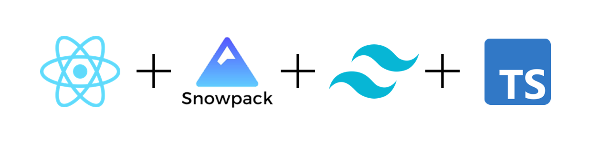

# React Snowpack Tailwind Typescript

A simple template for creating React-Typescript projects that are packed with Snowpack and styled with Tailwind!


## Installation

Clone this repository and run the `template.sh` file.
```
git clone https://github.com/aw1875/React-Snowpack-Tailwind-Typescript
cd React-Snowpack-Tailwind-Typescript
./template.sh
```
You will be prompted to enter a project name and then the script will install all dependencies and insert any necessary code to run. Optionally, you can pass in your project name as a parameter directly when you run the script:
```
./template.sh demoproject
```

## What's Included?

The code included will automatically inject React into all pages so theres no need to import it with `import React from "react"`. This can be removed from the `snowpack.config.mjs` file if you'd like.
```
buildOptions: {
  soureceMaps: true,
  /* Auto inject React into all pages */
  jsxInject: "import React from 'react'", /* Just remove this line if you don't want it */
},
```
Some Tailwind examples such as animations are included in the `App.tsx` code. Also, examples of both `useState` and `useEffect` are included along with a basic function formatting time.

## Issues

If you get any permission issues while trying to run the template script please make sure you set the permissions correctly.
```
chmod 777 template.sh
```
If you encounter anything else [please let me know](https://github.com/aw1875/React-Snowpack-Tailwind-Typescript/issues) so I can fix it.

### Why?

Mostly for myself as this is the frontend stack I work with most commonly. This is an easy way to have access to these files from any computer and with an easy auto setup.

